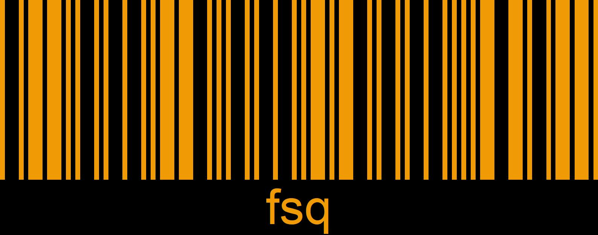

### About me

---

* I am an **undergraduate in corporate security, photographer, hobbyist astrophysicist, weather forecaster and a webdeveloper.**
* I can translate to and from **Russian** and **English**.
* I speak 4 languages: **Russian, Serbian, English** and **German**, currently learning **Japanese** and **Finnish**.
* I have worked on two constructed languages: **Fisse** and **Yana**

> My relationship with programming languages so far can only be described by trust and understanding - I don't trust them and they don't understand me

---

### Socials

* https://twitter.com/fsqs\_
* https://steamcommunity.com/id/kakuzetsu-thanatos
* @fsqs on discord

### Projects

* https://forusu.github.io/madewithlove-site - My website
* https://blog.madewithlove.top - My blog
* https://forusu.github.io/fsq-friends/ - A pseudo-webring for me and my friends!
